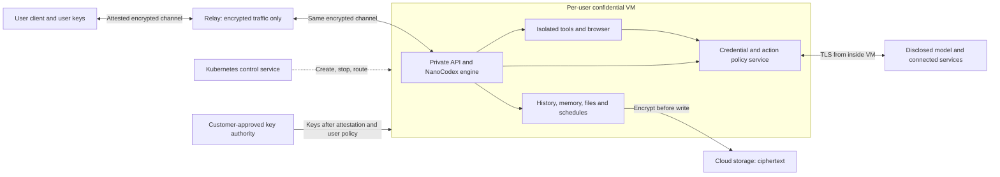

> Current delivery scope: the first implementation is the [text Agents API](../services/api/README.md) on ordinary Kubernetes. VMs, AX, and confidential execution are optional future work. This document describes the later privacy design, not the current deployment.

# NanoCodex managed service: deployment and privacy design

Checked: 21 September 2026. Status: source review and proposed architecture. No Kubernetes deployment or confidential hardware test has been run.

The user selected this privacy target: protect private content from the service operator and cloud operator. External model providers are permitted if the product clearly states which data they receive.

## Decision

Use NanoCodex as the agent engine. Run one complete private runtime per user in a confidential VM. Kubernetes manages the VM lifecycle, capacity, routing, and billing metadata. It must not process private conversation content or hold user data keys.

Do not use Google AX as a required dependency for the first release. Its task lifecycle is relevant, but its current runtime and trust model do not provide the required privacy boundary.

For the first hardware proof, use a cloud confidential VM controlled from Kubernetes. GCP Intel TDX is a candidate. If user workloads must run through the Kubernetes Pod API, evaluate Confidential Containers with Kata and peer pods. These are two different deployment paths; neither has been proved for NanoCodex here.

A confidential VM is already a trusted execution environment. A second enclave inside that VM is not needed just to encrypt memory. Client transport, persistent disks, backups, and key release need separate controls.

## What the requested branch contains

Inspected upstream:

- Feature head: [`0b2fd0feae09b6cf014d9af6780ae5a09cc7b3fe`](https://github.com/gakonst/nanocodex/commit/0b2fd0feae09b6cf014d9af6780ae5a09cc7b3fe).
- Master head: [`3e0da53c68d1ae61f43d5f68044ba50fcec0b0e8`](https://github.com/gakonst/nanocodex/commit/3e0da53c68d1ae61f43d5f68044ba50fcec0b0e8).
- The three-dot comparison has 41 feature-side commits and 139 changed files, with 64,314 added lines and 157 removed lines. Much of the addition is the imported and adapted terminal interface.
- Personal fork: [xavierroma/nanocodex](https://github.com/xavierroma/nanocodex). The fork contains `feat/nanocodex2` at the inspected feature head.

`nanocodex2` is a managed terminal client. The server owns the model connection, tools, history, memory, and child agents. The client uses an account API key and REST, SSE, and room WebSocket interfaces. The branch adds hosted account memory, session search, and shared-room behaviour. This is a useful starting point for a service. It is not a complete personal assistant product. [Branch guide](https://github.com/gakonst/nanocodex/blob/0b2fd0feae09b6cf014d9af6780ae5a09cc7b3fe/docs/NANOCODEX2.md), [API mapping](https://github.com/gakonst/nanocodex/blob/0b2fd0feae09b6cf014d9af6780ae5a09cc7b3fe/docs/NANOCODEX2_PLAN.md)

The current managed host uses Rust/WASM in Cloudflare Durable Objects. SQLite stores durable state. Its shell uses a bounded interpreter and a virtual filesystem. A separate Worker owns provider and connector credentials. This host cannot be moved to Kubernetes by adding a Deployment manifest. It depends on Durable Object storage, alarms, identity, bindings, and socket behaviour. [Managed host](https://github.com/gakonst/nanocodex/blob/0b2fd0feae09b6cf014d9af6780ae5a09cc7b3fe/services/managed/README.md), [implementation](https://github.com/gakonst/nanocodex/blob/0b2fd0feae09b6cf014d9af6780ae5a09cc7b3fe/services/managed/src/index.ts)

The Rust durability layer is reusable. It owns the journal, request deduplication, recovery, and ambiguous tool outcomes. It already supports native SQLite and Postgres. Reuse that layer inside the user VM; do not build a second agent state machine in the Kubernetes controller. [Durability contract](https://github.com/gakonst/nanocodex/blob/0b2fd0feae09b6cf014d9af6780ae5a09cc7b3fe/crates/nanocodex-durability/README.md)

The current libkrun VM path moves selected workspace tools into a VM. The agent and some tools remain on the host. Its capability enum includes SEV, TDX, and Nitro, but that is feature detection, not an implemented client-to-TEE key protocol. I found no complete confidential deployment path in the inspected VM code. [VM boundary](https://github.com/gakonst/nanocodex/blob/0b2fd0feae09b6cf014d9af6780ae5a09cc7b3fe/crates/experimental/nanocodex-vm/README.md), [capability detection](https://github.com/gakonst/nanocodex/blob/0b2fd0feae09b6cf014d9af6780ae5a09cc7b3fe/crates/experimental/nanocodex-vm/src/capabilities.rs)

Two existing controls must not be described as protection from the operator:

- The credential vault encrypts stored credentials with a key from the Worker environment. That protects stored records, but the Worker can decrypt them. [Vault code](https://github.com/gakonst/nanocodex/blob/0b2fd0feae09b6cf014d9af6780ae5a09cc7b3fe/services/egress/src/credential-vault.ts)
- Tracing can contain complete prompts, model output, and tool input/output. Exporting it to an ordinary operator log service would bypass the new privacy boundary. [Trace contract](https://github.com/gakonst/nanocodex/blob/0b2fd0feae09b6cf014d9af6780ae5a09cc7b3fe/crates/nanocodex-observability/README.md)

The existing source licences are MIT or Apache-2.0 for the core. The Tact-derived terminal has Apache-2.0 attribution. Preserve those notices in the fork. [Core README](https://github.com/gakonst/nanocodex/blob/0b2fd0feae09b6cf014d9af6780ae5a09cc7b3fe/README.md), [Tact attribution](https://github.com/gakonst/nanocodex/blob/0b2fd0feae09b6cf014d9af6780ae5a09cc7b3fe/bin/nanocodex/third-party/tact/README.md)

## Deployment strategy

The diagram is a proposal. Each arrow has to be verified in the first hardware test.

Keep two application units initially:

1. **Control service in Kubernetes.** Account access, subscriptions, quotas, instance lifecycle, opaque routing IDs, wake times, and content-free health metrics. Run the API and controller in one codebase. Add separate services only when a concrete boundary requires them.
2. **Private runtime in the user VM.** A native Rust host embeds NanoCodex and its durability layer. It owns sessions, memory, files, schedules, browser state, and the private API. One user VM can hold multiple conversations and child agents.

The key authority is a separate trust boundary. Reuse a reviewed attestation/key-release system where possible. Do not design a new cryptographic protocol to save a dependency.

The control service may create or stop an instance. It must not impersonate the user inside it. Authenticate private commands with a user-held key over the attested connection. Account login alone must not let an operator replace the user's private identity.

The first backend should provision an explicit confidential cloud VM and an encrypted persistent disk. This means the management software targets Kubernetes, while the protected compute uses the cloud VM API. It avoids assuming nested confidential virtualization is available on cluster workers.

Run the private host directly in that confidential VM. Use process or container isolation for tools and the browser inside it. Do not assume NanoCodex's current inner libkrun VM can run on a cloud TDX machine; nested virtualization is a separate capability to prove.

If all workload lifecycle must use Pods, use a separate `RuntimeClass` backed by Confidential Containers/Kata and, on a cloud cluster, peer pods. The confidential boundary is then the pod VM. Put the trusted private services for one user inside that boundary. A normal pod on a confidential worker node is not equivalent: the worker OS and kubelet can still access ordinary pods. [CoCo trust model](https://confidentialcontainers.org/docs/architecture/trust-model/trust-model/), [GCP peer-pod example](https://confidentialcontainers.org/docs/examples/gcp-simple/)

The controller needs a small lifecycle: `Provisioning -> AwaitingAttestation -> Ready -> Stopped`, with explicit failure and deletion states. Encrypted state survives compute shutdown. On restart, the VM must pass attestation again before it receives a data key. The trusted key/state authority must prevent two active owners of one writable workspace; a Kubernetes Lease alone cannot enforce this against a malicious cluster administrator.

Use restart from durable application state for the first version. Do not depend on live memory snapshots. Memory snapshots, migration, and suspend images require separate encryption and freshness proofs. Unsafe external actions must remain ambiguous after a crash unless their completion can be proved; do not silently repeat a purchase or message send.

## Privacy requirements

### Client connection and key release

The VM creates a connection key inside protected memory. Fresh hardware evidence binds that key to the approved runtime. The client or its approved verifier checks the certificate chain, security version, debug state, measurements, workload policy, and freshness. Only then may the client or key authority release the user's data key through that connection. [Trustee architecture](https://confidentialcontainers.org/docs/attestation/architecture/)

Keep the existing managed API semantics inside this protected channel. The current bearer-key HTTP client is not already an E2E confidential client. It needs verification of the attested server identity. TLS that ends at the public ingress is insufficient; use a reviewed attestation-bound channel that ends inside the VM. Google's Prompt Encryption SDK is a reference, not a drop-in NanoCodex transport. [Existing client](https://github.com/gakonst/nanocodex/blob/0b2fd0feae09b6cf014d9af6780ae5a09cc7b3fe/bin/nanocodex/src/nanocodex2/client.rs), [Google SDK](https://github.com/google/prompt-encryption-sdk)

An operator-controlled key broker with an operator-editable allowlist does not meet the target. Use customer-controlled keys, an independent authority, or an attested broker whose release rules are approved by the customer. Trustee must itself run in a trusted environment. [Trustee deployment requirements](https://confidentialcontainers.org/docs/attestation/)

Always-on service needs an explicit key recovery model. If only an offline phone holds the key, a stopped VM cannot restart by itself. A customer-approved online release service can permit restarts for approved software. A service-held universal recovery key would restore operator access.

An ordinary hosted web page also has a trust limit: its operator can replace JavaScript before it encrypts data. Start the strong privacy path with an independently checked installed client and explicit update rules. A web interface can follow, but server attestation alone does not protect client code delivery.

### Storage, updates, and operator access

Encrypt workspace files, memory, history, browser profiles, credentials, and backups before they leave the confidential VM. Use per-user keys. Disable or encrypt swap and crash dumps. Use an immutable approved boot image plus encrypted mutable user state; encrypting public OS binaries is not the central privacy requirement.

Encryption alone does not stop rollback to an old valid disk or the creation of two valid copies. The key/state protocol needs a trusted version or epoch, freshness checks, and exclusive write authority outside the hostile management plane. Define what occurs after a disk clone, restored backup, interrupted update, or revoked device.

Production policy must reject operator SSH, console commands, debug images, arbitrary startup scripts, new sidecars, and unapproved mounts. For CoCo, bind the guest agent policy into attestation, including denial of operator exec. Kubernetes RBAC is useful for normal operations but cannot exclude a cluster administrator by itself. [CoCo Init-Data](https://confidentialcontainers.org/docs/features/initdata/)

Publish approved image digests, build evidence, and an auditable update history. Key release must check the approved code and policy, not just that a VM uses TDX or SEV-SNP. An operator must not be able to approve a private malicious image for one user. Revocation and minimum safe software versions need explicit rules.

Keep full diagnostic records inside the encrypted user store. Export only an allowlist of operational measurements. Review error strings, request URLs, screenshots, filenames, support bundles, and provider failure bodies for content leakage.

### Agent safety and external services

The confidential VM protects from its host. It does not make model-generated shell code safe. Run the agent's tools and browser with fewer privileges than the credential and policy service. Keep credentials out of model context and arbitrary shell environments. The policy service must own approvals and outbound access inside the VM.

The provider connection must also start inside the VM. A conventional operator proxy that terminates provider TLS can read prompts and would break the selected target. API keys can be provisioned through the approved secret path. Use a documented, permitted API billing model; the branch's subscription demos are not a commercial-service approval.

The chosen model provider receives whatever text, files, images, and tool results the runtime sends for inference. Connected sites receive the data needed for authorised actions. State this clearly. A suitable product claim, after validation, is: **Your device connects to a verified private runtime. Service infrastructure cannot read your workspace. The model and services you choose receive the data required for their work.**

Traffic timing, destinations, resource use, and account/billing data can remain visible. The operator can interrupt service. Hardware/firmware trust, vulnerable approved code, and side channels remain limits. Do not promise that data is unreadable to every party under every condition.

## Is Google AX relevant?

Inspected AX at [`d8ed0fe38bceb7842d3c47817d53d16ccdfcb601`](https://github.com/google/ax/commit/d8ed0fe38bceb7842d3c47817d53d16ccdfcb601).

AX offers Task, Workspace, Gateway, and Model objects over Agent Substrate. Its services run on Kubernetes, but it adds its own API and task state. It is useful to study for declarative task lifecycle, workspace preparation, and pause/resume. Its README warns that core concepts and APIs can change. [AX README](https://github.com/google/ax/blob/d8ed0fe38bceb7842d3c47817d53d16ccdfcb601/README.md)

The current code has specific limits for this product:

- The actor template selects gVisor. AX does not expose a confidential runtime selector in the inspected Task path. [Template](https://github.com/google/ax/blob/d8ed0fe38bceb7842d3c47817d53d16ccdfcb601/internal/substrate/client.go#L227-L277)
- Snapshot settings preserve data and recreate processes. Do not assume complete VM memory resume from the CLI wording. [Same template](https://github.com/google/ax/blob/d8ed0fe38bceb7842d3c47817d53d16ccdfcb601/internal/substrate/client.go#L262-L270)
- The task reconciler permits any host on port 443 without a restrictive gateway and continues after an egress-policy error. That behaviour cannot enforce this product's mandatory network policy. [Reconciler](https://github.com/google/ax/blob/d8ed0fe38bceb7842d3c47817d53d16ccdfcb601/internal/controller/reconciler.go#L189-L202)
- The AX API has no authentication interceptor in the inspected server. The product would need its own mandatory account and ownership boundary. [API server](https://github.com/google/ax/blob/d8ed0fe38bceb7842d3c47817d53d16ccdfcb601/internal/server/server.go#L38-L129)

AX pins Agent Substrate `672533541dbfcd29084e4de2475267088bda3651`. Substrate's current main was also inspected at `bb0effed188e06a44e03862cb6ea993e58f86893`. It has Kata/Cloud Hypervisor microVM code, but the host assembles the writable filesystem and provides shared memory for snapshots. This is a host-trusted VM design. Current-main support must not be assumed to be a tested AX integration. [AX dependency](https://github.com/google/ax/blob/d8ed0fe38bceb7842d3c47817d53d16ccdfcb601/go.mod), [Substrate VM memory](https://github.com/agent-substrate/substrate/blob/bb0effed188e06a44e03862cb6ea993e58f86893/cmd/ateom-microvm/internal/ch/createvm.go#L22-L85), [Substrate filesystem](https://github.com/agent-substrate/substrate/blob/bb0effed188e06a44e03862cb6ea993e58f86893/cmd/ateom-microvm/rootfsupper.go#L20-L44)

The reviewed source did not establish client-bound remote attestation, customer key release, or protection of workspace content from the host. Those would still have to be built below or around AX. Its separate scheduling and state layer also overlaps with the small per-user VM controller proposed here. Keep it as an optional evaluation, not a launch dependency. This is an architectural judgment based on the inspected implementation, not a claim that AX cannot evolve.

## Hardware and platform choice

| Path | Assessment |
| --- | --- |
| GCP TDX VM, managed from Kubernetes | First proof candidate. GCP documents hardware measurement registers for TDX. A hardened guest and independent/client verification are still required. |
| CoCo/Kata/Trustee with peer pods | Best candidate when protected workloads must be Pods. More integration work for storage, guest policy, and recovery. |
| GCP Confidential Space | Useful hardened runtime and attestation reference. Test whether the browser, process isolation, and retained state fit its workload model. |
| Azure confidential VM | Credible alternative with confidential disk and key-release support. Select after testing region, quota, guest, and recovery requirements. |
| AWS Nitro Enclaves | Useful for a small trusted processor or key service. Less direct for a full browser and persistent agent: disk and network I/O require parent-side support. |

These assessments use [GCP attestation details](https://docs.cloud.google.com/confidential-computing/confidential-vm/docs/attestation-overview), [Confidential Space](https://docs.cloud.google.com/confidential-computing/confidential-space/docs/confidential-space-overview), [Azure confidential VMs](https://learn.microsoft.com/en-us/azure/confidential-computing/confidential-vm-overview), and [Nitro constraints](https://docs.aws.amazon.com/enclaves/latest/user/nitro-enclave.html). They do not establish capacity or performance for the selected account.

GCP's documented SNP measurement path includes provider-managed vTPM measurements for later boot stages. TDX is therefore the better first GCP test for the stated cloud-operator threat model. A Google-issued attestation assertion alone still leaves Google in the verifier trust path; verify the full chosen chain and measurement policy. [GCP attestation roots](https://docs.cloud.google.com/confidential-computing/confidential-vm/docs/attestation-overview)

Persistent storage is a concrete CoCo risk. Its August 2026 CAA storage report says the new encryption work is not in CAA v0.22.0 and lists GCP Persistent Disk integration as future work. Do not assume that a confidential Pod makes its PVC confidential. Prove the exact storage path or start with explicit in-guest disk encryption. [CAA storage status](https://confidentialcontainers.org/blog/2026/08/14/encrypted-persistent-storage-for-peer-pods-with-the-caa-csi-block-driver/)

Before selecting a region, check current hardware capacity, quota, disk limits, and restart behaviour. Supported-zone documentation is not a reservation. Price the full user VM, browser memory, encrypted storage, model usage, wake latency, and idle policy together. No cost or throughput claim has been measured here. [GCP supported configurations](https://docs.cloud.google.com/confidential-computing/confidential-vm/docs/supported-configurations)

## Product direction

Instinct describes a personal assistant connected to applications and devices, usable by text and calls. Muse describes a persistent personal computer, browser, connectors, background work, and approvals. The target is a personal agent service; NanoCodex2's terminal is an early client and test surface. [Instinct](https://instinct.com/), [Muse](https://ai.meta.com/muse/)

Meta's September 8 security description is especially relevant. It separates the agent from credential and action-policy services. It also states that the current service can be accessed by Meta for operations and describes a confidential VM option as planned for later in 2026. Your difference should therefore be a verified privacy boundary available in the product, plus clear limits. Do not assume competitors have no privacy plans. [Meta security design](https://research.meta.ai/blog/security-and-safety-for-ai-agents-our-approach-with-muse)

The first user experience should include chat, durable tasks, visible browser activity, narrowly scoped connectors, exact action approvals, editable memory, export/delete, and a clear provider disclosure. The user should see a small understandable privacy state, with technical attestation details available when needed.

Defer public multiplayer rooms until membership, key sharing, and revocation have a reviewed design. Account-owned memory maps naturally to one private user runtime; cross-user rooms add a different privacy boundary.

## First implementation sequence

1. **Private native host.** Add an application-owned Rust service around the existing agent and durability crates. Start with create/resume, prompt, event replay, cancellation, and restart. Use SQLite inside the encrypted user volume. Preserve typed managed API behaviour so the existing terminal remains useful. The [exe.dev native consumer](https://github.com/gakonst/nanocodex/blob/0b2fd0feae09b6cf014d9af6780ae5a09cc7b3fe/examples/exe-dev/README.md) is an embedding reference, not a production auth or privacy implementation.
2. **One real confidential VM.** Build the approved guest, verified client channel, key release, encrypted disk, and in-guest policy service. Use test data. Prove restart and rejection paths before adding a fleet.
3. **Kubernetes management.** Package the control service, least-privilege cloud identity, lifecycle reconciliation, resource quotas, ciphertext routing, and metadata metrics. Use one fixed provider initially. Scale compute separately from durable identity.
4. **Personal agent features.** Bring account memory/search into the private runtime, then add browser and connector flows, scheduled tasks, client recovery, and update approval. Keep the stable SDK separate from service policy.

The first confidential acceptance test must prove all of these:

- A client submits a prompt, uses a tool, disconnects, reconnects, and receives an ordered result.
- A VM restart restores files and committed history. It does not silently repeat an unsafe external action.
- A wrong image, changed policy, debug image, substituted connection key, stale quote, and wrong-user key request all fail before key release.
- Cluster-admin and cloud-project-admin attempts cannot read content through exec, console, logs, disks, snapshots, proxying, or a forged user command.
- A disk clone, stale backup, duplicate VM, and interrupted update exercise the freshness and single-owner rules.
- Provider traffic is encrypted through service infrastructure and is decrypted only at the disclosed provider endpoint.
- Revocation, customer recovery, support access, and software updates behave as the user-visible policy states.

Do not label the service confidential until these tests run on the exact production hardware and software path. Source review cannot prove them.

## Completion state

Completed here: inspected the requested branch; created and verified the personal fork; reviewed AX; compared confidential deployment options; wrote the deployment strategy and acceptance gates.

Not implemented or tested here: the new private host, Kubernetes controller, encrypted client transport, attestation/key service, encrypted disk recovery, and consumer application. No cloud resources were created and no deployment tests or upstream test suites were run.

The next design choices are the first cloud/region and the customer key/recovery policy. The architecture above keeps both explicit without claiming they are already solved.
